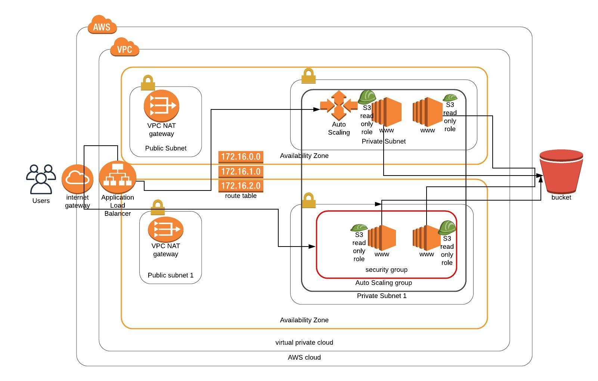

# Deploy-a-High-Availability-Web-App-Using-CloudFormation
Deploy Udagram, a highly available Web app using CloudFormation

The Problem statement is to automatically pickup HTML, CSS files from S3 and seemlessly deploy a highly available web application High Availability with best practices (Security Groups, Subnets, Roles etc.,) with 4 web servers, 2 in each private subnet in different AZs using CloudFormation. 

<h1>The Architecture Diagram</h1>

 

<h1> Source Code </h1>
The src folder contains the required cloudFormation code:
1. create.sh - For creation of the stack
2. update.sh - For updation of the stack.
3. project-network.yml - the manifest file required to build the network part of the infrastructure
4. project-network-parameters.json - has the needed parameters for the network yaml file
5. project-servers.yml - the manifest file to create the required servers for the infrastructure
6. project-servers-parameters.json - has the needed parameters for the servers yaml file

Outputs the url of the Load Balancer DNS name to be able to access the application.

Run the following: 
<b><i>
./create.sh project-stack project-network.yml project-network-parameters.json

./update.sh project-stack project-servers.yml project-servers-parameters.json
</b></i>

Note: The number of the minimum and maximum autoscale group numbers are set at 4 with instance type 'small'. You might incur costs if you let this running. 

